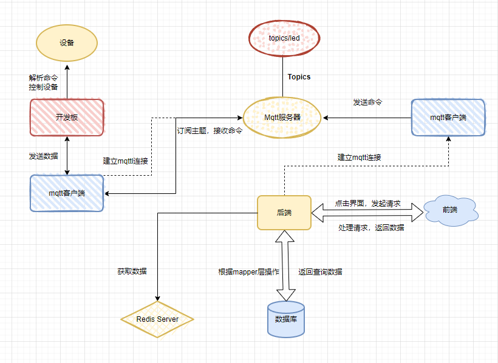
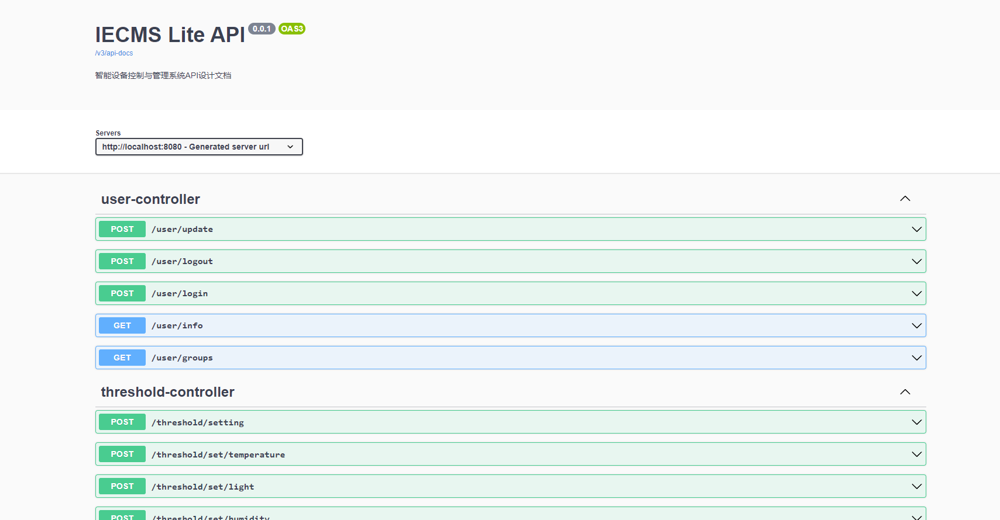
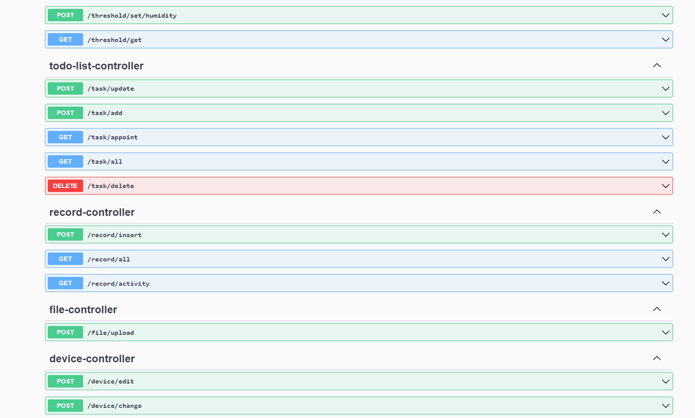
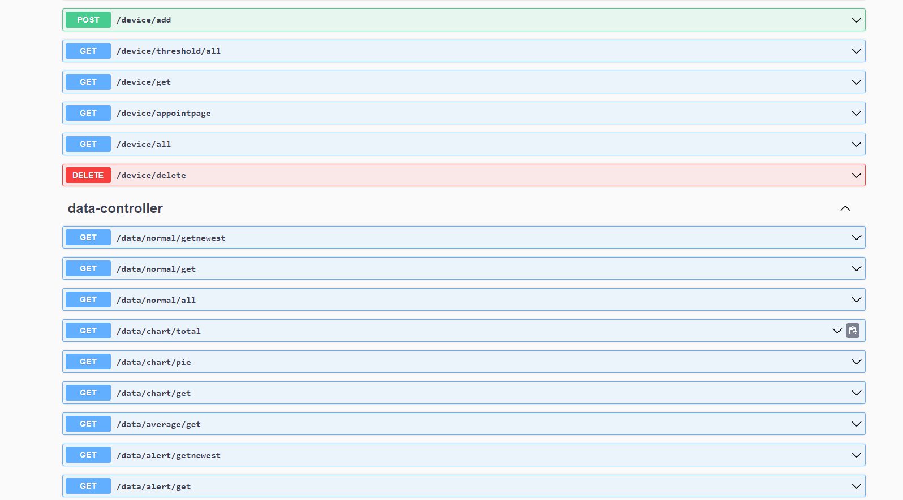
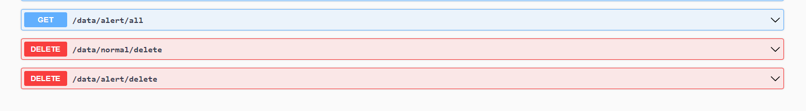
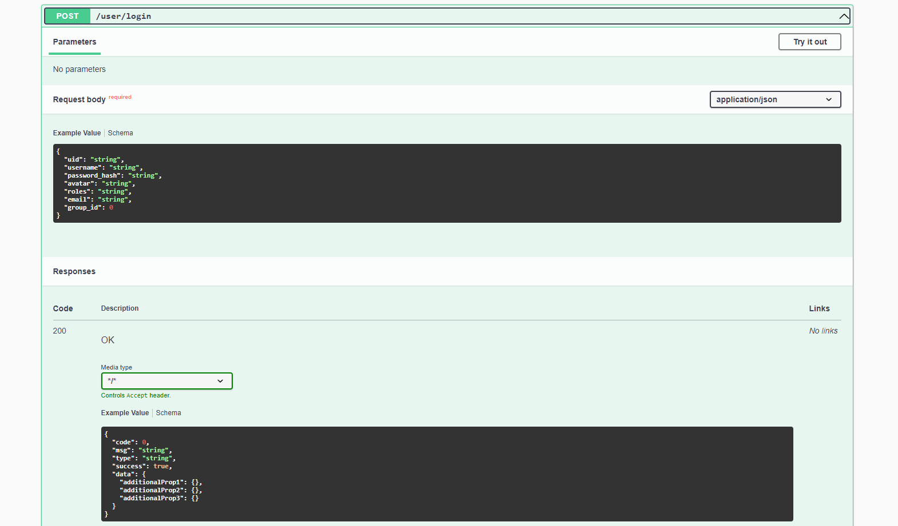
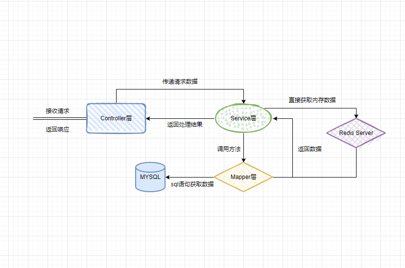
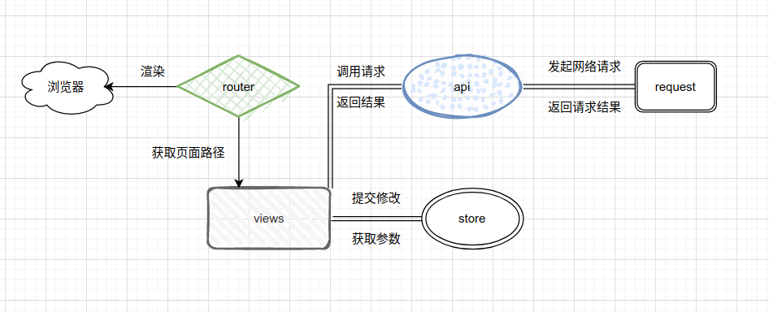

## 项目背景
随着互联网的日益发展，各类智能终端已遍布人们的日常生活。本项目致力于建立一个从嵌入式设备到互联网网页的实时控制链，旨在通过提供一系列可视化的用户接口以实现人们对各类嵌入式设备的控制。同时为建立一套更加贴合主流的智能家居打下一个基础。下面我将对本项目目前所具备的功能，运行的基本原理，开发工具的基本版本以及接口设计的基本原则等做一个简要的介绍。

## 项目基础功能

- [x] 小组用户信息的查看
- [x] 小组活动的情况查看，内含对设备的各类操作日志
- [x] 小组设备的增删改查
- [x] 小组设备的添加审核
- [x] 实时监控查看
- [x] 温湿度传感器阈值设置
- [x] 关照传感器阈值设置
- [x] LED灯控制
- [x] 蜂鸣器控制
- [x] 设备延时打开
- [x] 设备延时关闭
- [x] 设备基础模型展示（效果不佳）
- [x] 设备地理位置显示
- [x] 温湿度传感器数据采集
- [x] 光照传感器数据采集
- [x] 各类数据处理与图表展示
- [x] 用户基础信息修改
- [x] 用户各类操作信息展示，内含对设备的各类操作日志 
- [x] 设备告警控制 
- [ ] 设备建模
- [ ] 设备监控视频rtsp推流
- [ ] pcb绘制和制作
- [ ] 更多设备添加

## 项目架构设计图



## MQTT消息路径设计

|               设备               |            路径            |
| :------------------------------: | :------------------------: |
|        LED灯上行数据路径         |     `devTopic/pub/led`     |
|        LED灯下行数据路径         |     `devTopic/sub/led`     |
|        蜂鸣器上行数据路径        |     `devTopic/pub/led`     |
|        蜂鸣器下行数据路径        |     `devTopic/sub/led`     |
| 光照传感器(`BH1750`)上行数据路径 | `devTopic/pub/lightSensor` |
| 光照传感器(`BH1750`)上行数据路径 | `devTopic/sub/lightSensor` |
|     温湿度传感器上行数据路径     |  `devTopic/pub/htSensor`   |
|     温湿度传感器上行数据路径     |  `devTopic/sub/htSensor`   |
|  其他设备上行数据路径（待添加）  | `devTopic/sub/deviceName`  |
|  其他设备上行数据路径（待添加）  | `devTopic/pub/deviceName`  |


## MQTT中设备发送消息`json`格式设置

基本要求
- 确保复用性
- 可以用一个`data`字段来包含所有设备的信息，在`data`字段中去设置相应的字段值，从而实现对设备的控制。

例如
```c
{
    "data":{
        "led":{
            "status":"on"
            ...
        },
        "htSensor":{
            "temperture":23,
            "humidity":28,
            "status":"on"
            ...
        }
        ...
    }
}
```

但从实际使用情况来看，其实控制设备的时候发送的是命令指令(`command`)因此是否也可以为一系列指令集，诸如`LEDON,LEDOFF`之类，这样通过解析对应的`command`字段我们就可以解读出需要执行的指令。一个`command`可能是如下的形式

```c
command:[
  "LEDON","HTSENSOROFF","BEEPON","TEMPERTURE_DOWN_3"...    
]
```

通过这一步的封装，我们就可以在从前端网页界面对设备进行控制时，将对应的控制信息封装在数据中，当到达后端时在重新进行解析，`sub`或者`pub`的时候自动的获取或者发送所需要的数据。

## 数据库设计

### user数据表设计规定
|     名称      |    类型    |
| :-----------: | :--------: |
|   username    | vchar(30)  |
| password_hash | vchar(512) |
|    avatar     | vchar(100) |
|     roles     | vchar(40)  |
|   group_id    |    int     |
|     email     | vchar(60)  |
|      uid      |   bigint   |

### device数据表设计规定
|    名称     |   类型    |
| :---------: | :-------: |
|     did     |    int    |
|  group_id   |    int    |
| deviceName  | vchar(32) |
| insert_flag |    int    |
|  longitude  |   float   |
|  latitude   |   float   |
|   creator   | vchar(60) |
|    type     | vchar(40) |
|    date     | datetime  |
|   status    | vchar(8)  |

更多详细设计请看项目对应数据库文件


## 技术结构

|          | 技术栈                                |
| -------- | ------------------------------------- |
| 前端     | `vue2,ElementUI,threejs,amap,echarts` |
| 后端     | `springboot`                          |
| 数据库   | `mysql8.0.35`                         |
| 数据缓存 | `redis5.0.14.1`                       |
| MQTT服务 | `emqx5.3.2`                           |
| 嵌入式端 | `stm32f103c8t6,dht11,bh1750,beep,led` |

## `Api`设计

### 用户登录请求
POST /user/login

##### 请求

| 参数     | 说明     | 示例                                                             |
| -------- | -------- | ---------------------------------------------------------------- |
| username | 用户昵称 | echo                                                             |
| password | 用户密码 | def823239cd714d6f18cda2a2b9e1369046125716c43d27a1256753ac72164b0 |

##### 响应
| 参数 | 说明                                 | 示例    |
| ---- | ------------------------------------ | ------- |
| code | 20000登录成功，20001错误             |         |
| type | 本次请求是否成功,success/failure     | failure |
| msg  | 本次请求携带的信息，显示指明成功出错 | success |
| data | 请求返回的自定义数据信息             |         |

### 用户信息请求
GET /user/info

##### 请求
| 参数  | 说明     | 示例 |
| ----- | -------- | ---- |
| token | 识别用户 |      |


##### 响应
| 参数 | 说明                                             | 示例    |
| ---- | ------------------------------------------------ | ------- |
| code | 20000登录成功，20001错误                         |         |
| type | 本次请求是否成功,success/failure                 | failure |
| msg  | 本次请求携带的信息，显示指明成功出错             | success |
| data | 请求返回的自定义数据信息，包括头像地址和用户名等 |         |

### 设备信息请求
GET device/all

##### 请求
| 参数    | 说明     | 示例 |
| ------- | -------- | ---- |
| pageNum | 请求页码 | 2    |

##### 响应
| 参数 | 说明                                 | 示例    |
| ---- | ------------------------------------ | ------- |
| code | 20000登录成功，20001错误             |         |
| type | 本次请求是否成功,success/failure     | failure |
| msg  | 本次请求携带的信息，显示指明成功出错 | success |
| data | 该页所有设备信息                     |         |

### 设备修改请求
POST device/add

##### 请求
| 参数   | 说明               | 示例                                                                               |
| ------ | ------------------ | ---------------------------------------------------------------------------------- |
| Device | 待添加设备全部信息 | {deviceName: "fan", did: 3, longtitude: 122.23, latitude: 22.34, status: "on",...} |

##### 响应
| 参数 | 说明                                 | 示例    |
| ---- | ------------------------------------ | ------- |
| code | 20000登录成功，20001错误             |         |
| type | 本次请求是否成功,success/failure     | failure |
| msg  | 本次请求携带的信息，显示指明成功出错 | success |

其他的同样，具体细节详见自动生成文档。

### 在线查看

接口使用 `Restful` 风格进行接口设计并利用 `Swagger` 进行接口文档的生成，其中在线接口文档的查看方式为：启动后端项目，在浏览器输入如下路径: `http://localhost:8080/swagger-ui/index.html)`，可以在该界面进行接口的测试。如下图所示












## 模块化设计

### 后端系统模块化

如下图所示，在进行后端系统设计时，我们将所有的与前端有关的请求信息放置到了 `Controller` 层，其不负责处理数据，数据会向下传递到 `Service` 层，其利用 `Mappper` 层的方法处理前端请求并返回封装好的处理结果回到 `Controller` 层，最后返回给前端，一次请求处理结束。这样设计的好处在于，数据的处理和交互分开，互不影响。具体的细节做到了隐藏。



### 前端系统模块化

在进行前端系统设计时，我们将整体逻辑大致分为了如下图所示的几个部分。首先是浏览器通过路由页面获取 `views` 层数据并进行对应的渲染。而用户通过 `views` 层展示的各类内容发出事件请求，前端就利用 `api` 中封装的具体方法去利用 `request` 层发出 `axios` 请求。并接收后端返回的结果。其中有一些数据比如用户姓名，头像，`token` 等需要全局处理的东西，统一用 `store` 做一个管理，这样即能保证数据的有效性也能提供全局的访问。




## 软件功能详解

### 登录功能

用户通过浏览器提供的交互界面输入帐号和密码，前端程序获取帐号和密码，进行表单校验，通过后利用 `axios` 发送 `post` 请求给后端，后端接收到该请求后，将数据向下层传递到 `service` 层，利用用户名从数据库中查找出密码，进行匹配，符合返回成功响应，否则失败响应，前端根据响应结果决定是否放行。


### 设备管理

#### 设备列表总览

开始根据页码 `1` 发送一个 `get` 请求到后端，后端查询出第一页需要渲染的数据，默认为 `10` 个设备数据，以及总的设备个数。将其设置在统一返回体 `ResponseData` 的`data` 字段。然后返回给前端，前端拿到数据，通过返回状态码判断是否成功，成功通过表格进行渲染展示。当点击切换到不同的页码时，重新根据当前的页码发送请求，获取最新的数据进行相应的渲染。

#### 设备详细信息查看

用户点击设备列表总览中的更多按钮，通过路由携带设备的 `did` 跳转到对应的设备详情页，根据设备 `did` 发送一个 `get` 请求到后端，后端向下传递到 `service` ，并将查询到的数据进行设置，然后返回给前端，前端前数据渲染到对应的浏览器标签上。

#### 删除设备

用户点击对应的删除按钮，前端程序获取其 `did` ，一方面从该页的数据列表中删除该数据，另一方面携带着 `did` 发送一个 `delete` 请求到后端，后端同样传递到 `service` 层调用 `mapper` 层的接口方法将对应设备从数据库中删除并将结果返回给前端，前端将结果以通知的形式展示给用户。

#### 修改设备信息

用户点击对应的修改按钮，前端程序获取到对应的 `did`，去本页持有的 `tableData` 中找到对应的数据，然后将其对应的字段渲染到弹出的对话框中。用户修改后，点击确定按钮，前端获取此时的数据，发送一个 `post` 请求到后端，后端拿到数据，向下传递取出 `did`， 用 `mapper` 层的对应方法根据对应 `did` 将原始数据进行替换并返回对应的响应给前端，前端展示处理结果给用户。	

#### 增加设备

用户进入增加设备界面，输入对应的设备信息，点击增加按钮后，前端获取对应输入信息，发送一个 `post` 请求到后端，后端拿到数据，向下传递到 `service` 层。调用对应方法将该条数据插入到数据库中，并根据插入结果，返回对应的响应结果到前端，前端判断并将结果展示给用户。需要注意的是如果此时是非管理员用户插入那么我们此时做的插入操作是一个未插入，即将标志位`insert_flag`置为0，然后向`todolist`表中增加一个任务，待管理员成功审核后就将对应标志位置为1。

#### 设备模型展示

设备模型和设备详细信息查看放到了同一个页面，具体操作是通过设备 `did` 加载不同的设备，但是目前由于设备模型有限都是同一个模型。具体的渲染和操作通过 `Threejs` 来进行。

#### 设备位置展示

当我们从设备列表切换到设备的位置展示时，我们首先将对应的页面页码和设备数据存储到 `vuex` 管理的 `store` 中，当我们点击地图页面的显示位置的时候，我们从`vuex` 管理的 `store` 中取出对应的设备列表，用其对应的设备经纬度生成	 `marker`， 然后将其加载到 `map` 中。

#### 设备位置删除

点击页面删除坐标按钮，用 `splice` 方法将当前的 `marker` 全部移除。

#### 设备动作

设备动作按钮在设备详情页，目前为设备设定的动作主要有打开和关闭，另外在设置中也有延时打开和延时关闭。具体操作是，当用户点击按钮，用户获取对应的操作，进行赋值，发起一个 `post` 请求给后端，后端拿到数据，将此次动作的信息记录到数据库然后判断任务类型，如果是立即打开或关闭操作，那么直接通过 `mqtt` 协议发送一个消息到对应的设备（每个设备对应一个 `topic`）。如果是延时发送，那么首先将该次动作需要的信息放入到一个延时队列中，延时队列一直轮循判断，如果有任务到了其执行时间，那么取出该任务进行执行，执行完毕后移除该任务。如果我们用 `mqttx` 订阅相应的 `topic` 可以看到对应发送的消息，如果收到消息，那么我们的此次动作视为成功，反之视为失败。

### 告警管理

#### 告警信息列表展示

此处的处理和设备列表的展示和处理类似，我们都是发送一个 `post` 请求到后端，后端查询数据并返回，前端进行对应的渲染。

#### 数据图展示

数据图展示用到的依赖主要是 `echarts` ，当我们从告警信息展示页面点击图表展示，我们用路由携带着对应的设备 `did` 然后根据 `did` 发送一个 `get` 请求得到其所有告警数据，取出温度和日期，用 `echarts` 对应方法进行设置即可。另此次主要展示了三个图，分别为数据的平均温度图，告警温度图和正常温度图。

### 设备阈值参数修改

在后端中我们需要去判断当前拿到的数据是否为超过阈值上限的温度，根据判断的结果去发送报警信号，在此处我们制作了一个对应的设置界面来进行设置，用户选择对应的设备，其中设备根据其类型分为三类，温湿度传感器，光照传感器以及其他设备，只有传感器才能对其进行阈值设置。设置好对应的参数之后，我们发送对应的`post`请求到后端，修改数据库中存储的对应字段值并返回处理结果即可。

### 用户信息修改

用户可以修改个人密码，前端界面通过弹窗获取用户的输入，传入后端，后端首先根据用户名查询密码，如密码匹配则更新，否则返回密码错误信息，封装进统一返回结构体中，返回给前端，前端根据具体结果将信息展示给用户。其中设计到用户头像的问题，我们此处所做的处理是将其放到了前端项目的对应文件夹下，然后前端项目去引入对应的路径即可实现图片的回显。

### 实时监控

此模块主要用于监控设备，对设备的事实状态做一个视频的展示，但是由于目前的技术有限，具体细节仍在进一步完善中。

## 项目启动参数配置

### 嵌入式端端口对应情况
其中所有设备`Vcc`和`GND`部分只需接到对应正负极就行，没有过多要求,若图中未注明但在元器件上存在的端口直接玄空即可。

#### 蜂鸣器模块

| 端口 | 对应接线口 |
| ---- | ---------- |
| I/O  | PB12       |

#### LED灯模块

| 端口 | 对应接线口 |
| ---- | ---------- |
| +    | VCC        |
| -    | A0         |

#### DHT11模块

| 端口 | 对应接线口 |
| ---- | ---------- |
| DATA | PA8        |

#### BH1750模块

| 端口 | 对应接线口 |
| ---- | ---------- |
| SCL  | PB6        |
| SDA  | PB7        |


#### esp-01s模块

| 端口 | 对应接线口 |
| ---- | ---------- |
| RX   | PA2        |
| TX   | PA3        |
| RST  | PB8        |


#### Esp32Cam模块
连接电脑`usb`口即可

### 前端

```
npm i
npm run dev
```

### 后端

首先新建数据库 `iiot` ,用户名可以自定义但是要和配置文件相同, 然后用 `IDEA` 连接数据库，运行 `iiot.sql` 脚本，进行表的建立和初始数据的插入，点击运行即可。

下载`redis`，并启动`redis-server`,至此，项目配置启动完毕。